# Estate Document Analyzer - Technical Assesment

A Python application with a graphical user intefrace (GUI) that allows the user to select a PDF document related to estate planning (e.g., Will, Trust, Healthcare Directive, or Power of Attorney).


## Table of Contents

1. [Demo](#demo)
2. [Features](#features)
3. [Quick Start](#quick-start)
4. [Project Structure](#project-structure)
5. [Stack](#stack)
6. [How it Works](#how-it-works)
7. [License](#license)

## Demo


1. **Upload** a PDF  
2. Wait ≈ 2-15 s (text vs. scanned)  
3. Read the structured JSON & executive summary

---

## Features

| Area | Highlights |
|------|------------|
| **Extraction** | ▸ PyMuPDF text layer<br>▸ PDF Path if scanned |
| **LLM Pipeline** | ▸ LangChain PromptTemplate + `PydanticOutputParser`<br>▸ OpenAI File upload input + PydanticOutputParser <br>▸ JSON validation|
| **GUI** | ▸ One-file Streamlit app |
| **Cost control** | ▸ Uploads file only when needed<br>▸ Truncate text to ~3 k tokens |

---

## Quick Start

```bash
git clone https://github.com/alvaradoglza/estate_document_analyzer.git
cd estate-document-analyzer

# 1. create venv + install deps (uses uv)
uv venv .venv && . .venv/Scripts/activate  # Windows
uv pip sync requirements.lock

# 2. set your key
echo OPENAI_API_KEY=sk-... >> .env

# 3. run
streamlit run app.py
```


## Project Structure

```mermaid
%%{init: {'theme': 'neutral'}}%%
graph TD;
    ROOT["📁 estate-document-analyzer"] --> A["📄 .gitignore"];
    ROOT --> B["📄 README.md"];
    ROOT --> C["🐍 app.py"];
    ROOT --> D["📄 pyproject.toml"];
    ROOT --> E["📄 uv.lock"];
    ROOT --> F["📁 docs"];
    ROOT --> G["📁 estate_analyzer"];
    ROOT --> H["📁 sample_docs"];
    
    F --> F1["🖼️ demo.gif"];
    
    G --> G1["📁 utilities"];
    G1 --> G1a["📄 __init__.py"];
    G1 --> G1b["🐍 langchain_chain.py"];
    G1 --> G1c["🐍 llm_schema.py"];
    G1 --> G1d["🐍 llm_utils.py"];
    G1 --> G1e["🐍 pdf_utils.py"];
    
    H --> H1["📄 sample_scanned_will.pdf"];
    H --> H2["📄 sample_will.pdf"];
```




## Stack

| Layer             | Choice                                                  | Rationale                       |
| ----------------- | ------------------------------------------------------- | ------------------------------- |
| Runtime           | **Python 3.11**                                         | Matches JD & modern libs        |
| PDF               | **PyMuPDF**                                             | Fast, pure-Python, layout-aware |
| LLM orchestration | **LangChain-OpenAI 0.2**                                | Prompt templates, output parser |
| Model(s)          | **GPT-4o-mini**    | Cost efficient, file input abled and reasoning     |
| GUI               | **Streamlit**                                           | React-based, minimal code       |


## How it Works

**Text-based PDF**  
- `pdf_utils.extract_text` finds a text layer (`has_text_layer=True`)  
- LangChain Text Chain: `PromptTemplate` → `ChatOpenAI` → `PydanticParser`  
- Returns validated `EstateInfo`  

**Scanned PDF**  
- `has_text_layer=False`  
- PDF Chain uploads the file (`{"type":"file"}`) to `GPT-4o-mini`  
- Model sees & extracts in one pass → same `EstateInfo`  

## License
Unsure what to write here but common field on readme.md according to 
